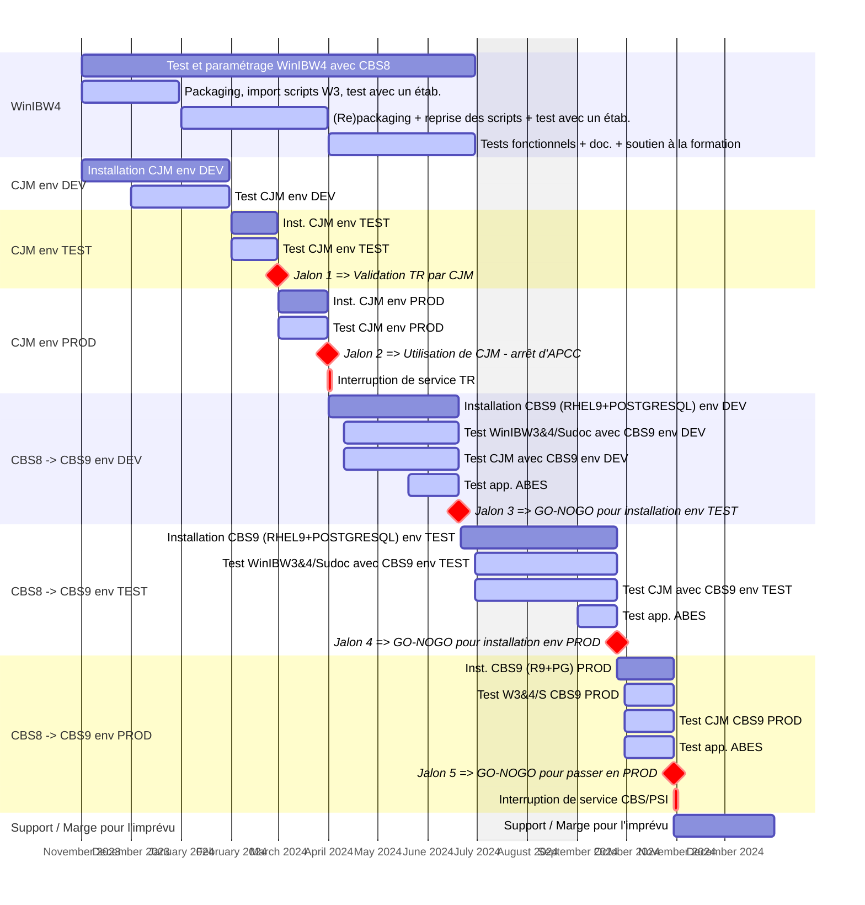

# timeline-CJM-CBS9
Timeline CJM and CBS9

[![](https://mermaid.ink/img/pako:eNqll99um0gUxl9lhNRto2AHBnAGS1spTrJpqnrjNd5aXflm1kxTVAwIBivdKO-yt93XyIvtDGM4_HPsqtz4BCbfj_nOmTPDo7aOfaaNtXsacb6KkLh4sP56G3GWbmmINnHEv6j79CHIfovTDeXo1QS9-qTu-pSz3d1P4hpMp4OrK_WIPazD3GcZwga2B8b5wDD1KsQQWhDaEDoQjiA8h5BA6FahaUAINBNoJtBMoJlAM4FmAs0Emgk0DDQMNAw0DDQMNAw0DDQMNAw0DDQLaFZJI2AqAVMJmErAVAKmEjCVgKkETCVgKgFTCZhKwFQCphIwlYCpBEwlYCoBUwmYSsBUAqYSMJWAqQRMJWAqAVMJmErAVAKmEjBVhKaq21WkfjO25kEcoWUQ3U6WtrqJ0IJlHDGOEprSzfN3ntJ7Vo5BdMvW6HLiEdRzjZfF61rCRUjbSLxCKT2j66_0PojudRRskjjlKFunQcIztLR0xCW4AOQREmD697BQpeI1t0xHS5vxxGwRRIirmSH0Zs5OkpKCTlHKkjTIGJLLtGSd9pJKjHx2-X7qs-1uArW5WDWStClDn-OoMDFioRT24_VQ_GRxzgMmpP9FIRVjZPuQTu9l2H1-lfkRIxGLtujq-mMJv40yTsOQtp-j3mscRBngmukxW1M6rFap9k6myEePensyi2tvUZ_NsPHkRa6ajcTuKDUgFrXfO51Dqu3pHJZ_T0MxHxP9-hZ9pGHgq2Qs5nLhFNimvCg-rm-CUOjGEdM3pk4_i00I1XnI8Pvdms3vrvrdkk-OcCtJY78q4r31fLRq263D8sotLN36kwdhkCm7fFYwB4im6fN_HPmvL2aXlz124aZdBbCyS5oiHqZ5UopmYnsP1kymo-_tC_Ug4ov5TlboI6ttvmxzg7fy120sif5VKEe9mb-7_uCezu68xc382vvjwwn8Y5GJibdn0WOjkQjVb61f7DMvF02l6rtua2028tAUr3a1jrh0fJ_g_ixPvFbLwnsBNEmG6GJy7SH0Az1k4l3MZgBw-gGqkCxZSDd3g9_vbu5QEucpCurJqFZ8p46seh1VxO7Ca-e-3a-Oyrt6BZX3WkMZwcbvin39BxJ_sDc2_Wwwq5NAh9mthz2cbj0cSfiJgqgRXFgwdYKqCPtwRRRdrVMRdqci9vTidkn0NGVVC6IQbk5e6qHdknCr851p1A5MqiSKalDiL4k2rau1ZLfKTFdc5v6Q8p7cH0n4idwfJqjcO53cJzQTW4BIU2Nendw7ndwfu7GI0Wcz73bfxlJuK053W_HypDj6nqEpTcXRunjf8LU4EKfP37d5CT4wrGNelic1f3ahOhpLSU3XNkycQwNffA0_yjsrjX9hG7bSxiIUZ1RhwUpbRU9iJM157H2L1tqYpznTtTyRn8FXAb0XnwTlzYRGf8Vx_U9t_Kg9aGPnfDgirokN5xxbI2Pk6No3bUzwkBDDsB08slzn3LWfdO2f4v_NoWmPMMG2ZdsjyxFrXGN-wON0qr7di0_4p_8BGF8Kdg?type=png)](https://mermaid.live/edit#pako:eNqll99um0gUxl9lhNRto2AHBnAGS1spTrJpqnrjNd5aXflm1kxTVAwIBivdKO-yt93XyIvtDGM4_HPsqtz4BCbfj_nOmTPDo7aOfaaNtXsacb6KkLh4sP56G3GWbmmINnHEv6j79CHIfovTDeXo1QS9-qTu-pSz3d1P4hpMp4OrK_WIPazD3GcZwga2B8b5wDD1KsQQWhDaEDoQjiA8h5BA6FahaUAINBNoJtBMoJlAM4FmAs0Emgk0DDQMNAw0DDQMNAw0DDQMNAw0DDQLaFZJI2AqAVMJmErAVAKmEjCVgKkETCVgKgFTCZhKwFQCphIwlYCpBEwlYCoBUwmYSsBUAqYSMJWAqQRMJWAqAVMJmErAVAKmEjBVhKaq21WkfjO25kEcoWUQ3U6WtrqJ0IJlHDGOEprSzfN3ntJ7Vo5BdMvW6HLiEdRzjZfF61rCRUjbSLxCKT2j66_0PojudRRskjjlKFunQcIztLR0xCW4AOQREmD697BQpeI1t0xHS5vxxGwRRIirmSH0Zs5OkpKCTlHKkjTIGJLLtGSd9pJKjHx2-X7qs-1uArW5WDWStClDn-OoMDFioRT24_VQ_GRxzgMmpP9FIRVjZPuQTu9l2H1-lfkRIxGLtujq-mMJv40yTsOQtp-j3mscRBngmukxW1M6rFap9k6myEePensyi2tvUZ_NsPHkRa6ajcTuKDUgFrXfO51Dqu3pHJZ_T0MxHxP9-hZ9pGHgq2Qs5nLhFNimvCg-rm-CUOjGEdM3pk4_i00I1XnI8Pvdms3vrvrdkk-OcCtJY78q4r31fLRq263D8sotLN36kwdhkCm7fFYwB4im6fN_HPmvL2aXlz124aZdBbCyS5oiHqZ5UopmYnsP1kymo-_tC_Ug4ov5TlboI6ttvmxzg7fy120sif5VKEe9mb-7_uCezu68xc382vvjwwn8Y5GJibdn0WOjkQjVb61f7DMvF02l6rtua2028tAUr3a1jrh0fJ_g_ixPvFbLwnsBNEmG6GJy7SH0Az1k4l3MZgBw-gGqkCxZSDd3g9_vbu5QEucpCurJqFZ8p46seh1VxO7Ca-e-3a-Oyrt6BZX3WkMZwcbvin39BxJ_sDc2_Wwwq5NAh9mthz2cbj0cSfiJgqgRXFgwdYKqCPtwRRRdrVMRdqci9vTidkn0NGVVC6IQbk5e6qHdknCr851p1A5MqiSKalDiL4k2rau1ZLfKTFdc5v6Q8p7cH0n4idwfJqjcO53cJzQTW4BIU2Nendw7ndwfu7GI0Wcz73bfxlJuK053W_HypDj6nqEpTcXRunjf8LU4EKfP37d5CT4wrGNelic1f3ahOhpLSU3XNkycQwNffA0_yjsrjX9hG7bSxiIUZ1RhwUpbRU9iJM157H2L1tqYpznTtTyRn8FXAb0XnwTlzYRGf8Vx_U9t_Kg9aGPnfDgirokN5xxbI2Pk6No3bUzwkBDDsB08slzn3LWfdO2f4v_NoWmPMMG2ZdsjyxFrXGN-wON0qr7di0_4p_8BGF8Kdg)
